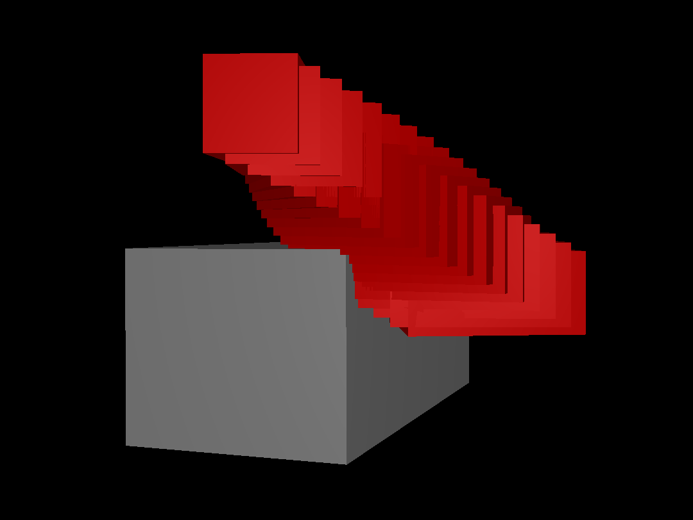

# parry3d Collision Detection Bug

This repository demonstrates a bug in parry3d's `cast_shapes_nonlinear` function where it fails to detect collisions between two cuboids that visibly intersect.

## Bug Description

The code shows a case where two cuboids clearly collide during motion (see visualization), but `cast_shapes_nonlinear` incorrectly returns no collision.

## Reproduction

- Run `cargo run` to see the visualization
- The `contact` function correctly reports penetration between the objects, confirming that they do intersect
- The red cuboid moves through the gray static cuboid
- Despite the intersection, the collision detection returns false

